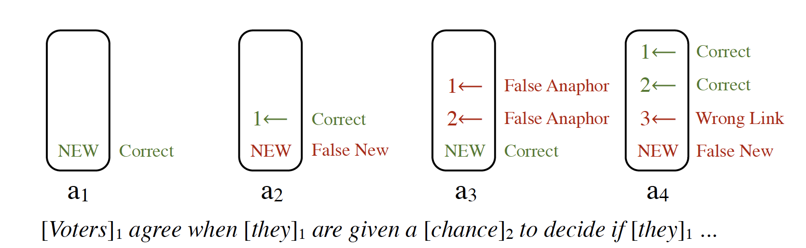
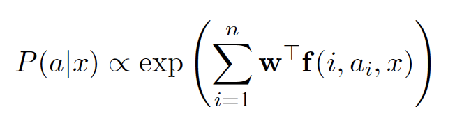
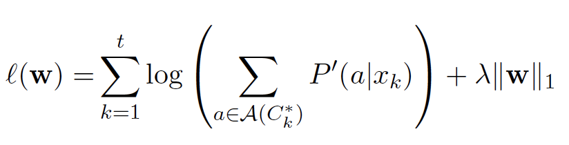
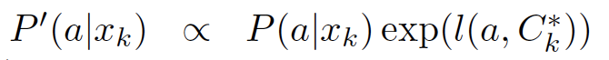
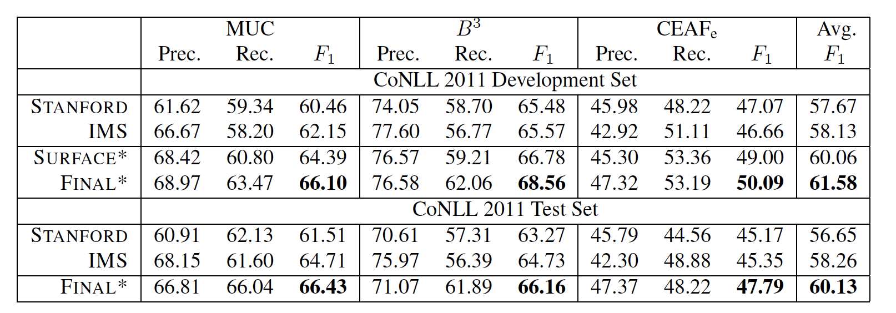

# The Summary of *"Easy Victories  and Uphill Battles in Coreference Resolution"*
#### EMNLP 2013

The papers presents a learning-based, mention-synchronous coreference system which utilizes the simplest features to address various aspects regarding coreference resolution. Although only surface-level document characteristics and superficial syntactic infomation are used, surprisingly, the system is able to achieve high performance, which is referred to as *Easy Victories* in the paper title. However, on the other hand, the behaviors of the system in capturing semantic information is not satisfactory because of the complex structural property.Therefore, semantic inforamtion extraction is considered as *Uphill Battles*.

## Mention-Synchronous Framework 
### Coreference Model
The mention-synchronous framework indicates that we use features to decide whether single mentions are anaphorics and pairs of mentions or not. So, the initial job is to indentify the set of mentions from text annotated with parses as well as named entity tags.

Afterwards, in order to choose at most one antecedent for each mention or determine it is the beginning of a new cluster, a log-linear model is adopted. 

As is depicted in Figure 1, the mention-ranking architecture serves as the backbone of this coreference system.

Figure 1 The basic structure of coreference model

We extracted *n* mentions from a document *x*. The i th mention has an association random variable ai taking values from {1,...,i-1,NEW}.This variable has i possible antecedence choices:link to one of the i-1 preceding mentions or just begin a new cluster. The sequence of ai can be regarded as a unique set of coreference chains, serving as the output of this system.

The system adopts a log-linear model of the condtional distribution P(a|x) as follows:

 
where **f**(i,ai,x) is a feature function that examines the coreference decision ai for mention *i* with document context *x*.

### Inference with Model
The inference process is efficient. We can obtain the result by maximizing logP(a|x), which decomposes linearly over each mention.
  
### Learning of Model
We optimize the conditional log-likelihood augmented with a parameterized loss function.C\* represents a gold clustering defined over gold mentions.Given *t* training examples of the form (xk,&nbsp;C\*k),the likelihood function can be written as follows:

where  withl(a,C\*) being a loss function. This final parameterized loss function is a weighted sum of the counts of three error types（false anaphor error, false new error, wrong link eror).

## Easy Victories from Surface Features
The surface feature set only includes the following properties of current mentions, corresponding antecedents and mention pairs: 
 
* Mention type (nominal, proper, or pronominal)
* The complete string of a mention
* The semantic head of a mention
* The first word and last word of each mention
* The word immediately preceding and the word immediately following a mention
* Mention length
* Two distance measures between mentions

In addition, the features consist of two conjunctions of each feature.Even though these features seem rather superficial and simple, they are adequate enough to yield a satisfying coreference result. The underlying reason is that they can capture implicitly the linguistic phenomena without the assitance of heuristic-driven features.  
 
For instance, Table 1 shows the corresponding relationship between heuristic-driven features and SURFACE features which are utilized in this system.

| Targets of heuristic-driven features | SURFACE features  |  
|:-------------: |:---------------:| 
| person, number, gender or animacy of mentions| conjunctions with pronoun identity  |         
| definiteness     | indicator on the first word of a mention        |           
| centering theory | word context        |  

Table 1 Heuristic-driven features VS  SURFACE features

Notably, these kinds of data-driven features are also able to model more patterns in the data by achieving finer level of granularity.  

To provide more insights into data-driven features and heuristic-driven features, the paper exhibits the results of ablation experiments.It is found that none of heuristic-driven features make substantial contribution on top of the data-driven features. To sum up, these simple features can help us gain victories on syntax-related subtask.

## Uphill Battles on Semantics
The features which are effective in capturing syntactic phenomena can not handle semantic phenomena well. So the system designers resort to external resources, such as WordNet hypernymy and synonymy, named entity types and so on.However, even the incorporation of these shallow semantic features cannot help the system succeed in modelling the semantic information.

The reason behind this situation is that the percentage of positive coreference links present in the training data is small.Determining the correct links is much more difficult as a result of the large quantities of possible antecedents.
Therefore, the coreference system needs very strong evidence for the purpose of making mentions coreferent. What's more, a weak indicator can not be trusted, for it will have a high "false positive" rate. 

Thus,it is concluded that capturing semantics in a data-driven,shallow manner remains an uphill battle.
## FINAL System and Results
The FINAL system incorporates additional features which the SURFACE system does not include. Specifically, two conjoined vairants of each feature are included:first with the type of the current mention, then with the types of both mentions in the pair. Thanks to these conjunctions, antecedent features regarding gender and number can influence pronoun resolution.
   
Full results of SURFACE and FINAL feature sets are shown in Table 1, which demonstrates that the system introduced in this paper has a better performance than these sophisticated systems, in spite of merely using simple features.
   
   

Table 2 CoNLL metric scores for our system on the CoNLL development and blind test sets, compared with the results of Lee et al. (2011)(STANFORD) and Björkelund and Farkas (2012)(IMS).

    
## Conclusion
In this paper, a coreference system using a simple and homogeneous set of features is presensted. Notwithstanding not explicitly targeting at specific infomration apropos mentions like heuristic-driven methods do, data-driven features can implicitly model sufficient linguistic phenonema used for coreference resolution. Nevertheless,complex outside information and deep heuristics are indispensable to ameliorate coreferene performance in the system mention setting, offering adequately strong indicators of coreference relationship.
   
To see the publicly available Berkeley Coreference Resolution System, please visit 
[here](http://nlp.cs.berkeley.edu/projects/coref.shtml).
